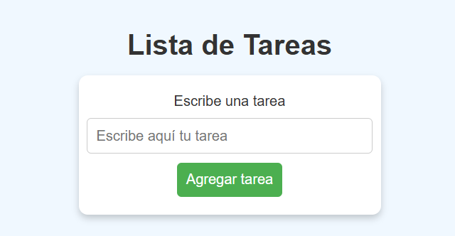

# 

Este proyecto es una aplicación web simple que permite gestionar tareas mediante un formato de notas adhesivas. Usando tecnologías como HTML, CSS y JavaScript, esta aplicación ofrece una manera visualmente atractiva y funcional de agregar y ver tareas.

## 🚀 Tecnologías utilizadas

- **HTML**: Estructura y presentación de la página.
- **CSS**: Diseño visual y estilos de la interfaz de usuario.
- **JavaScript**: Dinámica en el lado del cliente, permite agregar tareas y mostrarlas de manera interactiva.

## 📂 Estructura del Proyecto

La estructura del proyecto está organizada de manera sencilla para facilitar su comprensión y mantenimiento:

- **index.html**: Contiene la estructura básica de la página y el formulario de tareas.
- **styles.css**: Contiene los estilos visuales para que la página luzca atractiva y organizada.
- **script.js**: Contiene la lógica para agregar tareas a la lista y mostrar las notas de forma dinámica.
- **README.md**: Este archivo de documentación.

## 📜 Funcionalidades

Este proyecto incluye las siguientes funcionalidades:

- **Agregar tareas**: Escribe una tarea en el campo de texto y agrégala a la lista al hacer clic en el botón **"Agregar tarea"**.
- **Vista de tareas**: Cada tarea se muestra en un formato de post-it para facilitar su visualización.
- **Interacción dinámica**: Las tareas se agregan sin recargar la página, utilizando JavaScript para la manipulación del DOM.

## 🛠️ Instalación

Para ejecutar este proyecto en tu máquina local, sigue estos pasos:

1. **Clona el repositorio**:
   ```bash
   git clone https://github.com/DaniArranzOlmos/ListaTareas.git
